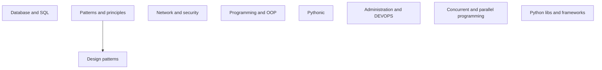

# IT-knowledge-base

```mermaid
graph TD;
    database_n_sql[Database and SQL];
    database_n_sql[Database and SQL];
    
    patterns_n_principles[Patterns and principles];
    
    patterns_n_principles ---> design_patterns[Design patterns];
    click patterns_n_principles "https://github.com/LastovkinKirill/design-patterns/" "link to repo"
    
    network[Network and security]
    programming_n_oop[Programming and OOP]
    pythonic[Pythonic]
    admin_n_devops[Administration and DEVOPS]
    concurrent_n_parallel_programming[Concurrent and parallel programming]
    py_libs[Python libs and frameworks]
```
# Node links
[Design patterns](https://github.com/LastovkinKirill/design-patterns/)
